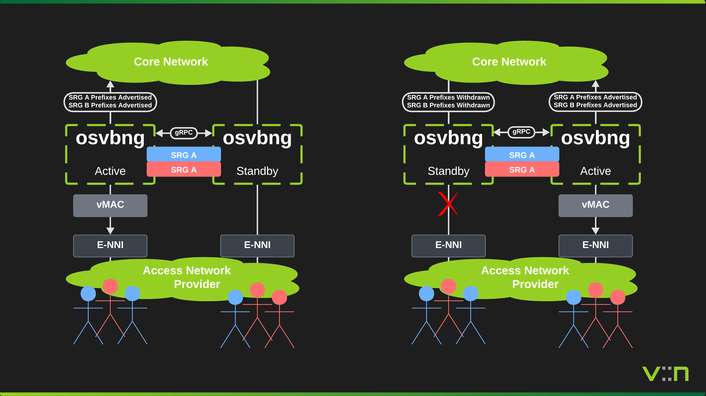
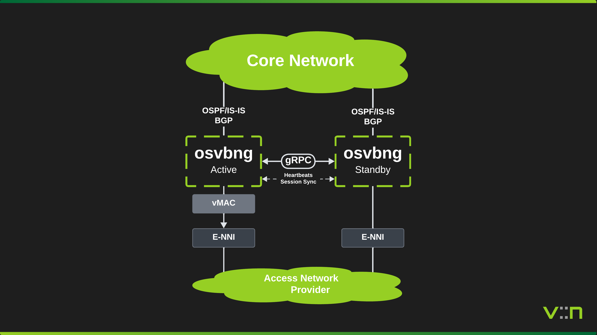
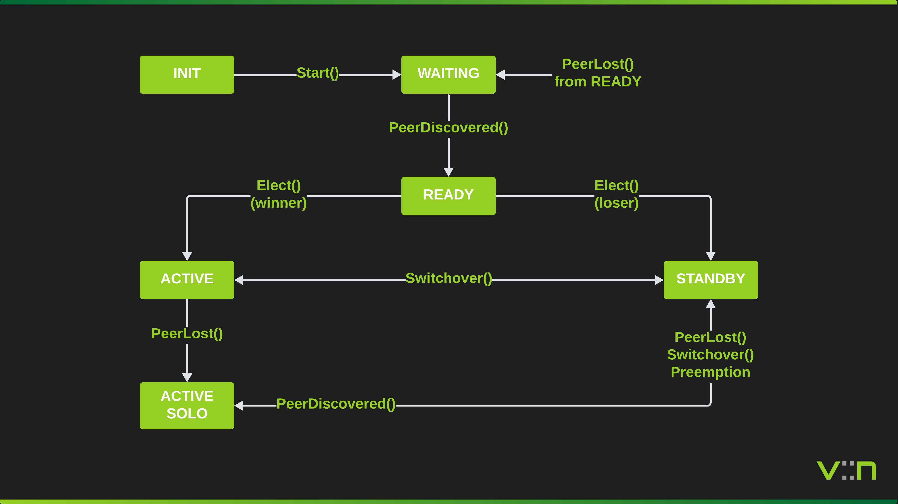

# High Availability

To provide redundancy for subscriber sessions, osvbng supports active/standby high availability using Subscriber Redundancy Groups (SRGs). An SRG is the logical failover unit that groups subscriber sessions, network prefixes, virtual MAC addresses, and tracked interfaces. Two osvbng nodes peer over gRPC and elect an ACTIVE and STANDBY role per SRG using priority-based election.

## Overview

Two BNG nodes serve the same set of subscribers over Ethernet access interfaces. The nodes can be co-located, in separate datacenters, or distributed across the network. The HA model is topology-agnostic. gRPC peer communication (heartbeats, state notifications, switchover requests) runs between the nodes over any IP-reachable path, typically a management network or the core-facing interfaces.

The ACTIVE node forwards subscriber traffic and advertises SRG network prefixes into BGP. The STANDBY node monitors the ACTIVE via heartbeat and is ready to take over. Failure detection is sub-second, based on configurable heartbeat interval and timeout.

## Subscriber Redundancy Groups

An SRG defines what fails over together:

- **Subscriber groups** - which subscriber sessions belong to this SRG
- **Networks** - BGP prefixes advertised when ACTIVE, withdrawn when not
- **Virtual MAC** - programmed in dataplane for seamless L2 failover
- **Tracked interfaces** - link state affects priority, triggering preemption
- **Priority** - determines which node wins election (higher wins, 1-255)

Multiple SRGs per pair are supported. By assigning opposite priorities across SRGs, both nodes can be ACTIVE simultaneously for different subscriber groups (active/active 50/50 split), eliminating wasted standby capacity.

## State Machine

Each SRG runs an independent state machine.

| State | Description |
|-------|-------------|
| INIT | Created, not yet started |
| WAITING | Started, waiting for peer connection |
| READY | Peer connected, ready for election |
| ACTIVE | Won election, forwarding traffic, advertising routes |
| STANDBY | Lost election, ready to take over |
| ACTIVE_SOLO | Was ACTIVE, peer lost, continues forwarding |
| STANDBY_ALONE | Was STANDBY, peer lost, does not auto-promote |

### Transition Table

| Current State | Event | New State | Condition |
|---------------|-------|-----------|-----------|
| INIT | Start() | WAITING | Always |
| WAITING | PeerDiscovered() | READY | Always |
| READY | Elect() | ACTIVE | Higher priority or lower node ID |
| READY | Elect() | STANDBY | Lower priority or higher node ID |
| READY | PeerLost() | WAITING | Peer timeout or disconnect |
| ACTIVE | PeerLost() | ACTIVE_SOLO | Continues forwarding alone |
| ACTIVE | Switchover() | STANDBY | Graceful handoff to peer |
| ACTIVE | PeerHeartbeatUpdate() | STANDBY | Peer also ACTIVE (split-brain: loses election) |
| STANDBY | PeerLost() | STANDBY_ALONE | Peer lost, does not auto-promote |
| STANDBY | Switchover() | ACTIVE | Graceful takeover from peer |
| STANDBY | PeerHeartbeatUpdate() | ACTIVE | Preempt enabled and wins election |
| STANDBY_ALONE | PeerDiscovered() | READY | Peer recovered, re-election follows |
| STANDBY_ALONE | Switchover(force) | ACTIVE | Forced manual promotion only |
| ACTIVE_SOLO | PeerDiscovered() | READY | Peer recovered, re-election follows |

## Peer Communication

Nodes communicate over a bidirectional gRPC stream (`HAPeerService.Heartbeat`).

- **Interval**: heartbeat sent every 1s (configurable)
- **Timeout**: peer considered lost after 5s without a heartbeat (configurable)
- **Payload**: node ID, sequence number, timestamp (for RTT and clock skew calculation), per-SRG status (name, state, effective priority)
- **Clock skew**: warn if >30s, refuse peering if >60s (triggers peer lost)
- **Reconnect**: exponential backoff from 1s to 30s on connection loss
- **TLS**: optional mTLS for production deployments

Additional RPCs beyond the heartbeat stream:

- `NotifySRGState` - async notification when an SRG changes state
- `RequestSwitchover` - request the peer to switch over specific SRGs

## Election

Election is triggered when:

1. Peer first discovered (both SRGs in READY)
2. Heartbeat shows peer priority changed (preempt enabled on local node)
3. Manual switchover requested

Rules:

1. Higher effective priority wins
2. Equal priority: lower `node_id` wins (alphabetical)
3. Preempt must be enabled on the node that wants to take over when its priority exceeds the current ACTIVE's

## Failover Scenarios

### Peer Loss

When peer connectivity is lost, both nodes independently detect the timeout. The ACTIVE node transitions to ACTIVE_SOLO and continues forwarding. The STANDBY node transitions to STANDBY_ALONE and does not auto-promote, avoiding a dual-active situation where both nodes advertise the same prefixes. A STANDBY_ALONE node can only be promoted via forced manual switchover (`Switchover(force)`). When the peer link recovers, both nodes return to READY and re-election runs.

### Interface Failure

Interface tracking adjusts the effective priority. When a tracked interface goes down, the configured `track_priority_decrement` is subtracted per down interface. If the peer has `preempt` enabled and now has higher priority, it takes over on the next heartbeat exchange.

### Manual Switchover

An operator triggers a switchover via the API (`POST /api/exec/ha/switchover`). The ACTIVE node transitions to STANDBY and notifies the peer, which transitions from STANDBY to ACTIVE. Routes and dataplane state follow the transition.

## Route Advertisement

On becoming ACTIVE:

1. Install a null0 blackhole route for each SRG network (required for BGP `network` statement to work)
2. Add `network <prefix>` under the appropriate BGP address-family (default or VRF)

On leaving ACTIVE:

1. Remove `network <prefix>` from BGP
2. Blackhole route remains (harmless, prevents routing loops during convergence)

Networks with a `vrf` field are advertised under `router bgp <ASN> vrf <VRF>`.

## Split-Brain Resolution

If both nodes believe they are ACTIVE (e.g. after a network partition heals):

1. Heartbeat exchange detects dual-ACTIVE (peer reports ACTIVE while local is also ACTIVE)
2. Election runs using the standard rules: higher priority wins, node ID tiebreak
3. The loser transitions to STANDBY
4. Resolved within one heartbeat interval

## Session Sync

The ACTIVE node incrementally replicates subscriber sessions to the STANDBY via gRPC. This allows the STANDBY to have a warm copy of session state for IP address reservation and operational visibility.

### Incremental Sync

When a session is created, updated, or deleted on the ACTIVE node, a `SyncSession` RPC is sent to the peer containing a `SessionCheckpoint` protobuf with the session's addresses, VLANs, MAC, access type, pool assignments, and SRG name. Each message carries a monotonically increasing per-SRG sequence number for gap detection.

The ACTIVE node buffers sync messages in a per-SRG backlog (default 10,000 entries) and drains them asynchronously over the peer connection. The STANDBY stores received checkpoints in the operational database (OpDB) under separate namespaces for IPoE and PPPoE sessions, and reserves IP addresses in the allocator registry to prevent conflicts on failover.

### Bulk Sync

When a STANDBY node first connects (or detects a sequence gap), it requests a full session dump via the `BulkSync` RPC. The ACTIVE iterates its live sessions using registered `SessionIterator` instances and streams them in pages (default 1,000 sessions per page). The STANDBY processes each page, storing checkpoints and reserving addresses. Bulk sync runs with a configurable timeout (default 60s).

### Sequence Tracking

Each heartbeat message includes the last sync sequence per SRG. This allows the peer to detect sync lag and trigger bulk sync recovery when needed.

## Virtual MAC

Each SRG can have a virtual MAC address that is programmed into the dataplane on all SRG interfaces. Both nodes program the same virtual MAC, ensuring that subscriber ARP/ND responses use a stable gateway MAC regardless of which node is ACTIVE.

On startup, the HA manager calls `AddSRG()` to program the virtual MAC on all resolved SRG interfaces. On state transitions, `SetSRGState()` activates or deactivates the MAC in the dataplane. On shutdown, `DelSRG()` removes it.

When failover occurs, the upstream L2 switches update their MAC-to-port tables naturally as the new ACTIVE node begins forwarding traffic. BGP reconvergence directs internet-bound traffic to the new ACTIVE, and the resulting frames sourced from the virtual MAC cause the switches to learn the new port. In QinQ deployments, this happens per-S-VLAN as each subscriber receives traffic.

## Active/Active (50/50 Split)

By configuring multiple SRGs with opposite priorities on each node, both nodes can be ACTIVE simultaneously for different subscriber groups. This eliminates wasted standby capacity.

For example, node-a runs with priority 200 for srg-north and priority 50 for srg-south, while node-b uses the inverse. After election, node-a is ACTIVE for srg-north and STANDBY for srg-south, while node-b is the opposite. Both nodes carry live subscriber traffic. Each SRG independently handles failover, so losing node-a causes only srg-north subscribers to fail over to node-b.
