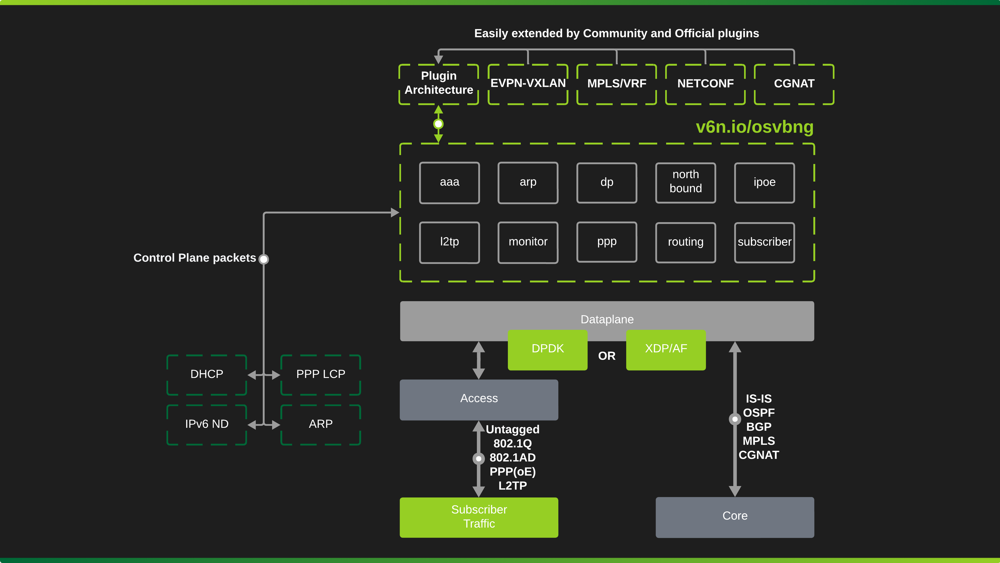
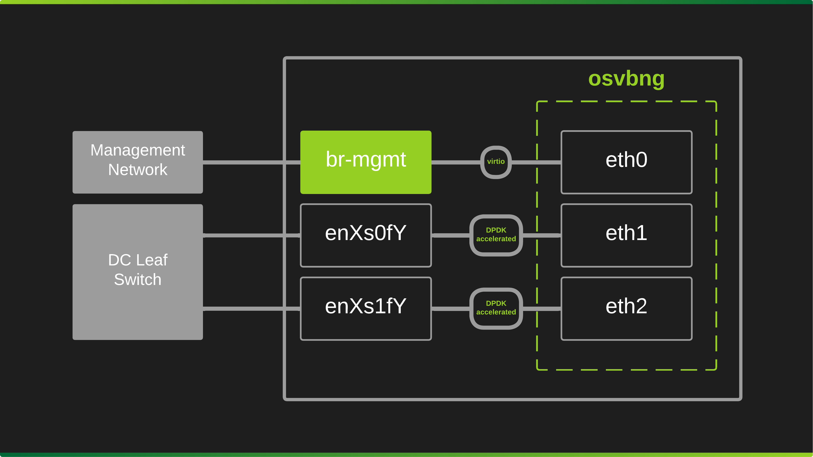

# Architecture

## Philosophy

osvbng takes an opinionated approach to BNG. Instead of exposing endless configuration options, it assumes your network is already well-designed: clean QinQ (or 802.1q) handoff, no duplicate S-VLANs, traffic delivered directly to the BNG.

This isn't a limitation, it's a feature. Less complexity means fewer failure modes, faster deployments, and a system that just works.

## Plugin Architecture

The core is intentionally minimal. Advanced functionality lives in plugins, letting the community extend osvbng without bloating the base system.

Need walled garden? VXLAN? NETCONF? Write a plugin. The core stays fast and simple.

## Performance Without Complexity

Cloud-native BNGs exist, but osvbng's goal is raw throughput. XDP, eBPF, and kernel-accelerated solutions hit a ceiling. DPDK doesn't.

osvbng scales with hardware. When 800Gbps and 1.2Tbps optics land, osvbng supports them out of the box. No code changes, no waiting for upstream patches.

!!! success "No vendor lock-in"
    Generic x86 hardware. Not Broadcom ASICs, SAI integrations, or proprietary SDKs. Commodity servers, commodity NICs.

No Kubernetes, no NFV orchestrator, no abstraction layers. Just a single binary on bare metal or a VM.

!!! tip "Development mode"
    Swap DPDK for virtio or af_packet. Same code, same config, just slower. Test locally, deploy to production with confidence.

## Deployment

